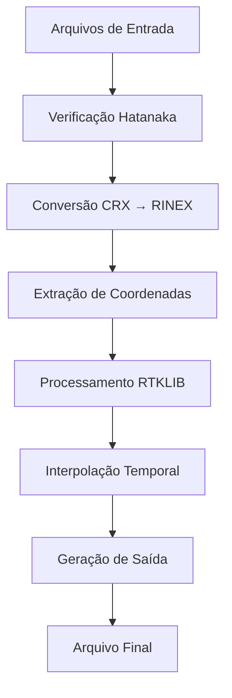

# PPK-DRONE - Processamento PPK para Drones DJI


## 📖 Descrição

O **PPK-DRONE** é uma aplicação em Python com interface gráfica desenvolvida para processar dados de posicionamento PPK (Post-Processed Kinematic) de drones DJI. A ferramenta utiliza o RTKLIB para realizar correções de alta precisão em dados GNSS, gerando coordenadas precisas para georreferenciamento de imagens capturadas por drones.

## ✨ Características

- 🎯 **Interface Gráfica Intuitiva**: Interface Tkinter simples e fácil de usar
- 📊 **Processamento PPK Automatizado**: Integração com RTKLIB (rnx2rtkp)
- 🔄 **Conversão Automática**: Suporte a arquivos Hatanaka (.??D → .??O)
- 🌐 **Múltiplos Formatos de Saída**: DJI Terra (CSV) e WebODM (TXT)
- 📍 **Interpolação Temporal**: Associação precisa entre timestamps de imagens e posições
- 🗺️ **Projeções Cartográficas**: Conversões entre sistemas de coordenadas
- ⚡ **Executável Standalone**: Versão compilada disponível

## 🏗️ Arquitetura do Sistema

```
PPK_DJI/
├── ppk_drone.py          # Interface principal (GUI)
├── ppk_process.py        # Módulo de processamento
├── config.conf           # Configurações RTKLIB
├── rnx2rtkp.exe         # Processador RTKLIB
├── crx2rnx.exe          # Conversor Hatanaka
├── icon.ico             # Ícone da aplicação
├── ppk_drone.spec       # Configuração PyInstaller
└── build/               # Arquivos de compilação
    └── dist/
        └── PPK_Drone.exe # Executável final
```

## 🚀 Instalação

### Pré-requisitos

```bash
pip install tkinter pyproj pandas numpy pillow
```

### Opção 1: Executar código Python

1. Clone o repositório:
```bash
git clone https://github.com/aleferobert/PPK_DJI.git
cd PPK_DJI
```

2. Execute a aplicação:
```bash
python ppk_drone.py
```

### Opção 2: Executável (Recomendado)

1. Baixe o executável da seção [Releases](https://github.com/aleferobert/PPK_DJI/releases)
2. Execute `PPK_Drone.exe`

## 📋 Como Usar

### 1. Preparação dos Dados

Certifique-se de ter os seguintes arquivos:

- **`.MRK`**: Arquivo de marcação de imagens do drone DJI
- **`.OBS (Rover)`**: Dados GNSS do drone (pode ser `.??O` ou `.??D`)
- **`.OBS (Base)`**: Dados da estação base (pode ser `.??O` ou `.??D`)
- **`.NAV`**: Arquivo de navegação/efemérides (`.??N`)

### 2. Interface Principal

1. **Selecionar arquivos**: Use os botões "..." para selecionar cada arquivo
2. **Verificar informações**: O sistema mostra automaticamente:
   - Coordenadas da base e rover extraídas dos arquivos
   - Período de observação
3. **Coordenadas da base (opcional)**: Insira coordenadas conhecidas em formato GMS
4. **Formato de saída**: Escolha entre DJI Terra ou WebODM
5. **Executar**: Clique em "Executar script"

### 3. Formatos de Entrada Suportados

#### Arquivos RINEX/Hatanaka
- `.OBS`, `.??O` (RINEX Observation)
- `.??D` (Hatanaka comprimido - convertido automaticamente)
- `.NAV`, `.??N` (RINEX Navigation)

#### Arquivos DJI
- `.MRK` (Arquivo de marcação de timestamps)

### 4. Formatos de Saída

#### DJI Terra (CSV)
```csv
file_path,latitude,longitude,height,pitch,roll,yaw
DJI_0001.JPG,-23.550520,-46.633308,760.123,1.2,-0.8,45.6
```

#### WebODM (TXT)
```
+proj=utm +zone=23 +ellps=WGS84 +datum=WGS84 +units=m +no_defs
DJI_0001.JPG	331234.56	7394567.89	760.12
```

## 🔧 Configuração Avançada

### Arquivo config.conf

O arquivo de configuração RTKLIB permite ajustar:

- **Modo de posicionamento**: Kinematic, Static, etc.
- **Frequências GNSS**: L1, L1+L2, L1+L2+L5
- **Máscaras de elevação**: Filtro por ângulo de elevação
- **Ambiguidade**: Configurações AR (Ambiguity Resolution)
- **Sistemas GNSS**: GPS, GLONASS, Galileo, etc.

### Conversão de Coordenadas

```python
# Exemplo de conversão GMS para Decimal
def dms_to_decimal(gms_str):
    # Aceita formatos: "-23°34'45.6", "-23 34 45.6"
    # Retorna: -23.579333...
```

## 🛠️ Compilação do Executável

### Usando PyInstaller

1. Instale o PyInstaller:
```bash
pip install pyinstaller
```

2. Compile usando o arquivo `.spec`:
```bash
pyinstaller ppk_drone.spec
```

3. O executável será gerado em `dist/PPK_Drone.exe`

### Configuração do .spec

```python
# ppk_drone.spec
a = Analysis(
    ['ppk_drone.py'],
    datas=[
        ('rnx2rtkp.exe', '.'),
        ('crx2rnx.exe', '.'),
        ('config.conf', '.'),
        ('ppk_process.py', '.')
    ],
    hiddenimports=['ppk_process', 'pyproj', 'tkinter'],
    # ... outras configurações
)
```

## 📊 Fluxo de Processamento



## 🔍 Detalhes Técnicos

### Processamento de Timestamps

1. **Leitura do .MRK**: Extrai GPS Week e Time of Week (TOW)
2. **Conversão GPS Time**: Converte para datetime Python
3. **Associação com imagens**: Mapeia cada timestamp para arquivo de imagem
4. **Interpolação**: Calcula posições para timestamps exatos das fotos

### Sistemas de Coordenadas

- **Entrada**: WGS84 Geodésico (lat/lon/alt)
- **Processamento**: ECEF (Earth-Centered Earth-Fixed)
- **Saída**: Configurável (WGS84, UTM, etc.)

### Ângulos de Atitude

Os ângulos de pitch, roll e yaw são:
- Extraídos do arquivo .MRK em radianos
- Convertidos para graus na saída
- Interpolados temporalmente junto com as posições

## 🧪 Teste e Validação

### Dados de Teste

```bash
# Estrutura típica de dados de entrada
projeto_drone/
├── DJI_0001.JPG ~ DJI_NNNN.JPG  # Imagens
├── Evento.MRK                    # Marcações
├── rover_2024001a.24o           # GNSS Rover
├── base_2024001a.24o            # GNSS Base
└── brdc_2024001.24n             # Navegação
```

### Validação de Resultados

1. **Verificar coordenadas**: Compare com pontos de controle conhecidos
2. **Consistência temporal**: Verifique sequência cronológica
3. **Precisão**: Avalie resíduos e qualidade da solução PPK

## 🐛 Solução de Problemas

### Erros Comuns

#### "Erro ao converter CRX para RINEX"
- Verifique se o arquivo `.??D` está íntegro
- Confirme se `crx2rnx.exe` está presente

#### "Falha ao executar RNX2RTKP"
- Verifique o arquivo `config.conf`
- Confirme compatibilidade dos arquivos RINEX
- Verifique período de dados coincidentes

#### "Formato GMS inválido"
- Use formato: `grau minuto segundo`
- Exemplo: `-23 34 45.6` ou `-23°34'45.6"`

### Logs e Debug

Para debug, verifique:
- Mensagens no terminal/console
- Arquivo `.pos` gerado pelo RTKLIB
- Qualidade da solução PPK (Fixed/Float)

## 📈 Melhorias Futuras

- [ ] Suporte a múltiplas missões
- [ ] Interface para edição de configurações RTKLIB
- [ ] Visualização de trajetória em mapa
- [ ] Relatórios de qualidade automatizados
- [ ] Suporte a outros formatos de drone
- [ ] Processamento em lote
- [ ] Integração com serviços de efemérides precisas

## 🤝 Contribuição

1. Fork o projeto
2. Crie uma branch para sua feature (`git checkout -b feature/AmazingFeature`)
3. Commit suas mudanças (`git commit -m 'Add some AmazingFeature'`)
4. Push para a branch (`git push origin feature/AmazingFeature`)
5. Abra um Pull Request

## 📄 Licença

Este projeto está licenciado sob a Licença MIT - veja o arquivo [LICENSE](LICENSE) para detalhes.

## 👨‍💻 Autor

**Alefe Robert**
- GitHub: [@aleferobert](https://github.com/aleferobert)
- Email: [alefetorresrr@gmail.com](mailto:alefetorresrr@gmail.com)

## 🙏 Agradecimentos

- [RTKLIB](http://www.rtklib.com/) - Biblioteca de processamento GNSS
- Comunidade DJI - Documentação de formatos de arquivo
- Contribuidores do projeto

---

⭐ **Se este projeto foi útil para você, considere dar uma estrela!**